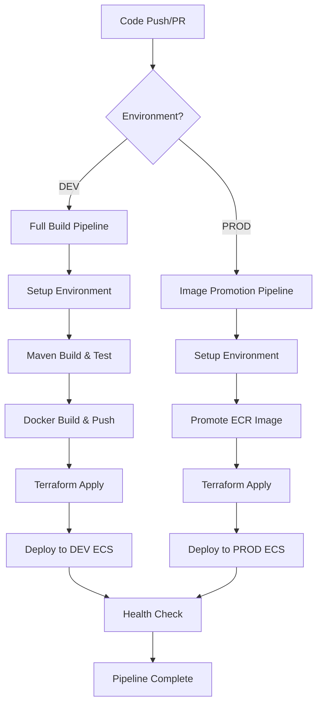
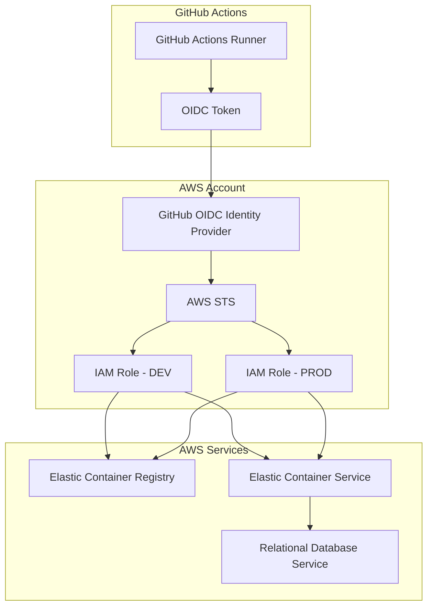
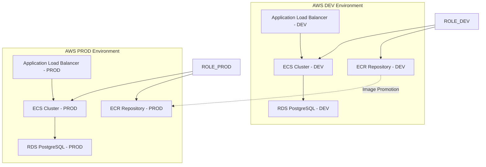

# Design Document: GitHub Actions CI/CD Pipeline

## Overview

This design outlines a comprehensive CI/CD pipeline using GitHub Actions for the TicketMaster application, supporting dual-environment deployment (DEV and PROD) with image promotion strategy. The pipeline automates building, testing, containerization, infrastructure provisioning via Terraform, and deployment to AWS ECS with RDS backend.

The key architectural decision is implementing an image promotion workflow where DEV environment builds and tests new code, while PROD environment promotes validated images without rebuilding, ensuring consistency and reducing deployment risk.

## Architecture

### Pipeline Flow Architecture



### Environment Strategy

**DEV Environment (develop branch)**:
- Full build, test, and deployment cycle
- Creates new Docker images tagged with commit SHA and environment
- Provisions/updates DEV infrastructure
- Deploys to DEV ECS cluster

**PROD Environment (main/release branch)**:
- Skips build and test phases
- Promotes existing DEV image by retagging
- Provisions/updates PROD infrastructure
- Deploys promoted image to PROD ECS cluster

### AWS Authentication Architecture



### AWS Infrastructure Architecture



## Components and Interfaces

### OIDC Authentication Setup

#### GitHub OIDC Identity Provider Configuration
**AWS Setup Requirements**:
- OIDC Identity Provider in AWS IAM
- Provider URL: `https://token.actions.githubusercontent.com`
- Audience: `sts.amazonaws.com`
- Thumbprint: Automatically retrieved during setup

#### IAM Role Configuration
**DEV Environment Role**:
```json
{
  "Version": "2012-10-17",
  "Statement": [
    {
      "Effect": "Allow",
      "Principal": {
        "Federated": "arn:aws:iam::ACCOUNT:oidc-provider/token.actions.githubusercontent.com"
      },
      "Action": "sts:AssumeRoleWithWebIdentity",
      "Condition": {
        "StringEquals": {
          "token.actions.githubusercontent.com:aud": "sts.amazonaws.com",
          "token.actions.githubusercontent.com:sub": "repo:OWNER/REPO:ref:refs/heads/develop"
        }
      }
    }
  ]
}
```

**PROD Environment Role**:
```json
{
  "Version": "2012-10-17", 
  "Statement": [
    {
      "Effect": "Allow",
      "Principal": {
        "Federated": "arn:aws:iam::ACCOUNT:oidc-provider/token.actions.githubusercontent.com"
      },
      "Action": "sts:AssumeRoleWithWebIdentity",
      "Condition": {
        "StringEquals": {
          "token.actions.githubusercontent.com:aud": "sts.amazonaws.com",
          "token.actions.githubusercontent.com:sub": "repo:OWNER/REPO:ref:refs/heads/main"
        }
      }
    }
  ]
}
```

#### Required IAM Permissions
**DEV Role Permissions**:
- ECR: `GetAuthorizationToken`, `BatchCheckLayerAvailability`, `GetDownloadUrlForLayer`, `BatchGetImage`, `PutImage`, `InitiateLayerUpload`, `UploadLayerPart`, `CompleteLayerUpload`
- ECS: `UpdateService`, `DescribeServices`, `DescribeTaskDefinition`, `RegisterTaskDefinition`
- RDS: `DescribeDBInstances`, `DescribeDBClusters`
- S3: Terraform state bucket access
- IAM: `PassRole` for ECS task execution role

**PROD Role Permissions**: Same as DEV but scoped to PROD resources

### GitHub Actions Workflow Components

#### 1. Environment Setup Job
**Purpose**: Configure build environment and tools with OIDC authentication
**Inputs**: 
- Environment type (DEV/PROD)
- GitHub OIDC token for AWS authentication
- IAM Role ARN for target environment
**Outputs**: 
- Configured Java 21 runtime
- AWS CLI with assumed role session
- Maven with dependency cache
- Terraform with AWS provider

#### 2. Build and Test Job (DEV Only)
**Purpose**: Build application and run quality checks
**Inputs**: 
- Source code from repository
- Maven cache from previous builds
**Outputs**: 
- Compiled JAR artifact
- Test results and coverage reports
- Maven dependency cache update

#### 3. Docker Operations Job
**Purpose**: Handle container image lifecycle
**Inputs**: 
- JAR artifact (DEV) or image reference (PROD)
- Environment-specific configuration
**Outputs**: 
- Tagged Docker image in ECR
- Image digest and tags for deployment

#### 4. Infrastructure Job
**Purpose**: Manage AWS resources via Terraform
**Inputs**: 
- Environment-specific Terraform variables
- Deployment configuration (apply/destroy)
**Outputs**: 
- Provisioned/updated AWS infrastructure
- ECS cluster and service configurations
- RDS connection details

#### 5. Deployment Job
**Purpose**: Deploy application to ECS
**Inputs**: 
- Docker image reference from ECR
- ECS service configuration
**Outputs**: 
- Updated ECS service with new image
- Health check results
- Service endpoint URLs

### Configuration Interfaces

#### Pipeline Configuration File (`.github/workflows/deploy.yml`)
```yaml
# Environment-specific configuration
env:
  ENVIRONMENT: ${{ github.ref == 'refs/heads/main' && 'prod' || 'dev' }}
  DESTROY_INFRASTRUCTURE: false  # Set to true for teardown
```

#### Terraform Variable Files
- `terraform/environments/dev.tfvars`
- `terraform/environments/prod.tfvars`

#### Environment-Specific Secrets
- `AWS_ROLE_ARN_DEV` - IAM Role ARN for DEV environment
- `AWS_ROLE_ARN_PROD` - IAM Role ARN for PROD environment  
- `ECR_REPOSITORY_DEV` / `ECR_REPOSITORY_PROD`

#### OIDC Configuration
- GitHub OIDC Identity Provider configured in AWS
- IAM Roles with trust relationships to GitHub repository
- Environment-specific role permissions

## Data Models

### Pipeline State Model
```yaml
PipelineExecution:
  id: string                    # GitHub run ID
  environment: enum[DEV, PROD]  # Target environment
  commit_sha: string            # Source commit
  image_tag: string             # Docker image tag
  terraform_action: enum[apply, destroy]
  status: enum[pending, running, success, failed]
  created_at: timestamp
  completed_at: timestamp
```

### Image Metadata Model
```yaml
DockerImage:
  repository: string            # ECR repository URL
  tag: string                   # Image tag (commit SHA + environment)
  digest: string                # Image digest for immutable reference
  environment: enum[DEV, PROD]  # Source environment
  commit_sha: string            # Source code commit
  build_timestamp: timestamp
  promoted_from: string         # For PROD images, reference to DEV image
```

### Infrastructure State Model
```yaml
TerraformState:
  environment: string           # DEV or PROD
  state_bucket: string          # S3 bucket for remote state
  state_key: string             # State file key
  workspace: string             # Terraform workspace
  last_applied: timestamp
  resources: array              # List of managed resources
```

## Correctness Properties

*A property is a characteristic or behavior that should hold true across all valid executions of a system-essentially, a formal statement about what the system should do. Properties serve as the bridge between human-readable specifications and machine-verifiable correctness guarantees.*

### Property Reflection

After analyzing all acceptance criteria, I identified several areas where properties can be consolidated:
- Cache behavior properties (2.1, 2.2) can be combined into a comprehensive cache management property
- Image tagging properties (3.2, 3.6) can be unified into a single tagging consistency property  
- Infrastructure management properties (4.1, 4.2, 4.3, 4.4, 4.6) can be consolidated into environment-specific infrastructure property
- Deployment properties (5.1, 5.2, 5.3, 5.4, 5.5) can be combined into comprehensive deployment consistency property
- Image promotion properties (8.1, 8.2, 8.3, 8.4, 8.6) can be unified into a single promotion workflow property

### Core Properties

**Property 1: Environment-specific build behavior**
*For any* pipeline execution, when the environment is DEV, all build and test steps should execute, and when the environment is PROD, all build and test steps should be skipped
**Validates: Requirements 2.6**

**Property 2: Maven cache consistency**
*For any* DEV pipeline execution, if Maven dependencies are cached, they should be restored, and if not cached, they should be downloaded and cached for future builds
**Validates: Requirements 2.1, 2.2**

**Property 3: Test failure propagation**
*For any* DEV pipeline execution, if Maven tests fail, the pipeline should fail and halt further execution
**Validates: Requirements 2.3**

**Property 4: Build optimization**
*For any* DEV pipeline execution, if tests pass during the test phase, the build phase should not re-execute tests
**Validates: Requirements 2.4**

**Property 5: Build-to-container consistency**
*For any* successful DEV build, a Docker image should be created from the application artifact
**Validates: Requirements 2.5**

**Property 6: Image tagging consistency**
*For any* Docker image operation, DEV images should be tagged with commit SHA and environment tags, and PROD images should be retagged from existing DEV images with PROD-specific tags
**Validates: Requirements 3.2, 3.6**

**Property 7: ECR image availability**
*For any* image push operation, the image should be verifiable as available in ECR after the push completes
**Validates: Requirements 3.3, 3.4**

**Property 8: Image promotion workflow**
*For any* PROD deployment, the pipeline should identify the corresponding DEV image, verify its existence, retag it for PROD, and proceed with deployment using the promoted image
**Validates: Requirements 3.5, 8.1, 8.2, 8.3, 8.4, 8.6**

**Property 9: Environment-specific infrastructure management**
*For any* infrastructure operation, Terraform should use environment-specific state backends and variable files, and operations should only execute when configuration permits
**Validates: Requirements 4.1, 4.2, 4.3, 4.4, 4.6**

**Property 10: Infrastructure failure handling**
*For any* infrastructure operation failure, the pipeline should halt deployment and provide clear error reporting
**Validates: Requirements 4.5**

**Property 11: Deployment image consistency**
*For any* ECS deployment, DEV should use newly built images from the same pipeline run, and PROD should use promoted images from DEV environment
**Validates: Requirements 5.1, 5.2**

**Property 12: Zero-downtime deployment**
*For any* ECS service update, the deployment should use zero-downtime strategy and wait for service stability before completion
**Validates: Requirements 5.3, 5.4**

**Property 13: Deployment health verification**
*For any* completed deployment, the service should be verified as healthy and responding before marking deployment as successful
**Validates: Requirements 5.5**

**Property 14: Deployment rollback on failure**
*For any* failed deployment, the system should automatically rollback to the previous stable version
**Validates: Requirements 5.6**

**Property 15: Configuration-driven infrastructure actions**
*For any* pipeline execution, infrastructure destroy should only occur when destroy flag is set, and apply should only occur when apply flag is set
**Validates: Requirements 6.3, 6.4**

**Property 16: Early configuration validation**
*For any* pipeline execution with invalid configuration, the pipeline should fail early with clear error messages
**Validates: Requirements 6.5**

**Property 17: PROD environment protection**
*For any* PROD pipeline execution, explicit approval or specific branch/tag triggers should be required
**Validates: Requirements 6.6**

**Property 18: Image promotion error handling**
*For any* PROD deployment, if the corresponding DEV image is not found, the pipeline should fail with a clear error message
**Validates: Requirements 8.5**

<function_calls>
<invoke name="prework">
<parameter name="featureName">github-actions-cicd

## Error Handling

### Pipeline Failure Scenarios

#### Build and Test Failures
- **Maven Test Failures**: Pipeline halts immediately, preserves test reports for debugging
- **Compilation Errors**: Build job fails with detailed error logs, no Docker image creation
- **Dependency Resolution**: Clear error messages for missing or incompatible dependencies

#### Infrastructure Failures
- **Terraform Plan Failures**: Display plan errors, halt before apply/destroy operations
- **AWS Authentication**: Clear error messages for credential or permission issues
- **Resource Conflicts**: Detailed error reporting for resource naming or quota conflicts
- **State Lock Issues**: Automatic retry with exponential backoff, manual intervention guidance

#### Deployment Failures
- **ECR Authentication**: Retry with exponential backoff, fallback to manual intervention
- **Image Not Found**: Clear error messages with image reference details for debugging
- **ECS Service Failures**: Automatic rollback to previous stable version
- **Health Check Failures**: Detailed health check logs, automatic rollback trigger

#### Image Promotion Failures
- **Missing DEV Image**: Fail with clear error indicating required DEV image details
- **ECR Access Issues**: Retry with exponential backoff, escalate to manual intervention
- **Tag Conflicts**: Clear error messages with conflicting tag details

### Error Recovery Strategies

#### Automatic Recovery
- **Transient AWS API Failures**: Retry with exponential backoff (max 3 attempts)
- **Network Timeouts**: Automatic retry for network-related failures
- **ECS Deployment Failures**: Automatic rollback to previous stable service version

#### Manual Intervention Required
- **Configuration Errors**: Pipeline fails early with clear guidance for fixes
- **Permission Issues**: Detailed error messages with required permissions
- **Resource Quota Exceeded**: Clear error with quota details and resolution steps

#### Rollback Procedures
- **Failed Deployments**: Automatic ECS service rollback to previous task definition
- **Infrastructure Issues**: Manual Terraform rollback with preserved state
- **Image Corruption**: Fallback to previous known-good image version

## Testing Strategy

### Dual Testing Approach

The testing strategy employs both unit tests and property-based tests to ensure comprehensive coverage:

**Unit Tests**: Verify specific examples, edge cases, and error conditions
- GitHub Actions workflow syntax validation
- Terraform configuration validation
- Docker image build verification
- AWS resource configuration testing

**Property-Based Tests**: Verify universal properties across all inputs
- Pipeline behavior consistency across environments
- Image promotion workflow correctness
- Infrastructure state management
- Deployment rollback mechanisms

### Property-Based Testing Configuration

**Testing Framework**: GitHub Actions with custom test runners
- **Minimum Iterations**: 100 iterations per property test
- **Test Tagging**: Each property test references its design document property
- **Tag Format**: `# Feature: github-actions-cicd, Property {number}: {property_text}`

### Test Categories

#### Pipeline Integration Tests
- End-to-end workflow execution in test environments
- Multi-environment deployment validation
- Image promotion workflow verification
- Infrastructure provisioning and teardown

#### Component Unit Tests
- Individual job validation (setup, build, deploy)
- Terraform module testing
- Docker image build verification
- AWS resource configuration validation

#### Security and Compliance Tests
- OIDC token validation and role assumption
- IAM permission boundary verification  
- Role session duration and scope validation
- Audit trail verification for assumed roles

#### Performance and Reliability Tests
- Pipeline execution time benchmarks
- Resource utilization monitoring
- Failure recovery testing
- Rollback performance validation

### Test Environment Strategy

**Isolated Test Environments**: 
- Separate AWS accounts for testing
- Dedicated ECR repositories for test images
- Isolated Terraform state backends

**Test Data Management**:
- Synthetic test applications for pipeline validation
- Mock AWS services for unit testing
- Test-specific configuration files

**Continuous Testing**:
- Automated test execution on pipeline changes
- Scheduled integration test runs
- Performance regression detection

### Monitoring and Observability

**Pipeline Metrics**:
- Execution time per job and overall pipeline
- Success/failure rates by environment
- Resource utilization during builds and deployments

**Alerting Strategy**:
- Immediate alerts for pipeline failures
- Notification for deployment rollbacks
- Performance degradation warnings

**Audit and Compliance**:
- Complete audit trail of all pipeline executions
- Image promotion tracking and verification
- Infrastructure change logging
- Security event monitoring